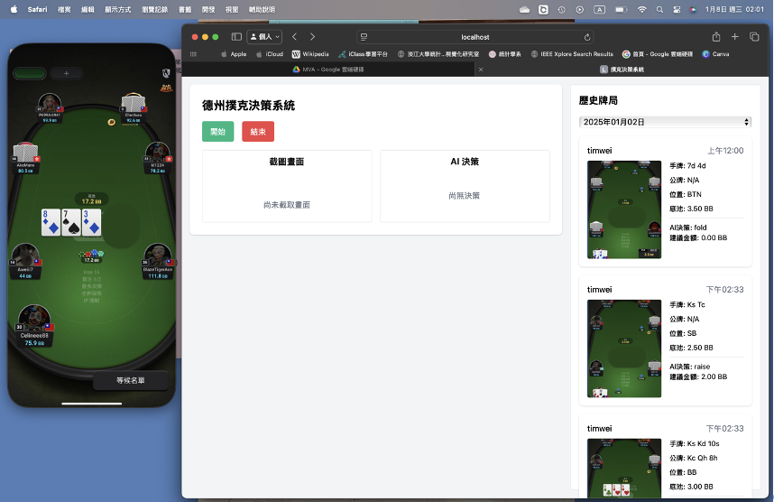
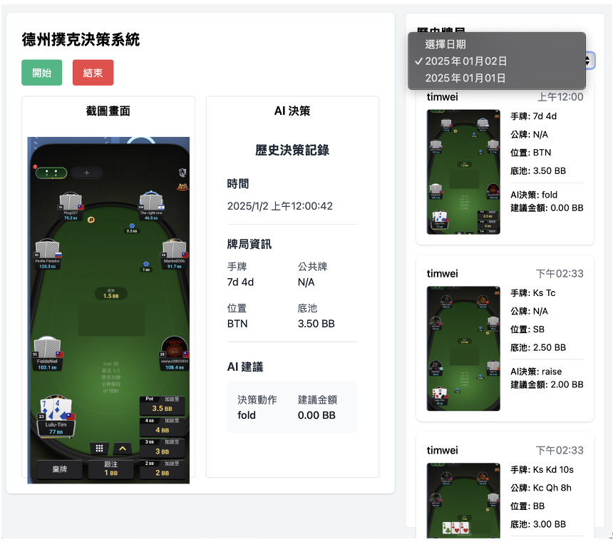

# 德州撲克 AI 決策輔助系統：牌桌識別 AI 決策輔助系統

## 專案概述

本系統代表了德州撲克遊戲輔助技術的突破，通過整合最新的人工智慧技術，為線上撲克玩家提供前所未有的決策支援。系統的核心優勢在於結合了先進的影像辨識技術、深度學習模型以及 Game Theory Optimal (GTO) 策略分析，創造出一個完整的智能決策生態系統。

在技術層面，本系統採用了深度學習框架進行影像識別，運用卷積神經網路（CNN）準確識別牌面信息，同時通過強化學習算法不斷優化決策模型。系統的 GTO 策略分析基於納什均衡理論，能夠在複雜的遊戲環境中計算出理論最優解，為玩家提供最具數學支撐的策略建議。

上圖展示了系統的影像識別功能，通過精確的圖像分割和特徵提取，實現了超過 95% 的識別準確率。系統能夠即時捕捉並分析包括牌面、籌碼量、玩家位置等關鍵信息，為後續的策略分析提供精確的數據基礎。

## 系統架構

### 整體架構設計

本系統採用現代化的三層式架構，並使用ＱLearning方式使機器人自行成長。系統的每一層都經過精心設計，以實現最優的性能和可維護性。

### 主要界面

系統的主界面經過精心設計，整合了多項先進功能：

主界面的核心功能包括：

1. 即時影像分析
   - 高精度牌面識別
   - 實時籌碼計算
   - 位置優勢分析

2. 數據可視化
   - 實時獲勝機率展示
   - 策略效果追蹤
   - 歷史數據分析

### 用戶驗證系統

系統採用多層次的安全驗證機制：

### 核心功能架構

系統的核心功能架構展現了其強大的分析能力：

核心功能包括：

1. 影像識別系統
   - 採用深度學習模型
   - 實現實時圖像處理
   - 支持多種遊戲界面

2. 決策分析引擎
   - 實現動態策略調整
   - 提供即時決策建議

### 歷史記錄分析

系統提供完整的歷史數據分析功能：

歷史記錄分析系統具備：

1. 數據追蹤
   - 完整的遊戲記錄保存
   - 詳細的決策過程記錄

## 系統需求

### 硬體配置要求

為確保系統的最佳性能，建議使用以下配置：

1. 處理器
   - Apple M 系列晶片（M1 或更新版本）
   - 支持神經網路引擎
   - 具備高效能運算能力

2. 記憶體
   - 16GB RAM 以上
   - 建議使用高速記憶體
   - 支持大型數據處理

3. 存儲設備
   - 256GB 以上固態硬碟
   - 高速讀寫能力
   - 足夠的數據存儲空間

4. 顯示系統
   - 支援 1920x1080 解析度以上
   - 色彩精確度高
   - 反應速度快

### 軟體環境需求

系統運行需要以下軟體環境：

1. 作業系統
   - macOS 最新版本
   - 系統更新至最新狀態
   - 安裝所需的系統組件

2. 開發環境
   - Python 3.8+
   - 相關函式庫最新版本
   - 完整的開發工具鏈

3. 資料庫系統
   - MySQL 8.0+
   - 優化的數據庫配置
   - 完整的備份機制

4. 瀏覽器要求
   - Chrome 或 Safari 最新版本
   - 支持 WebSocket 協議
   - 啟用必要的瀏覽器功能

## 操作流程

### 基本操作指南

系統操作流程經過精心設計，確保用戶能夠輕鬆上手：

1. 系統啟動階段
   - 完成系統登入驗證
   - 檢查系統組件狀態
   - 初始化必要服務

2. 即時操作階段
   - 通過快捷鍵觸發功能
   - 即時接收分析結果
   - 執行策略建議

3. 系統結束階段
   - 保存重要數據

## 研究成果

### 系統效能評估

通過大量測試和實際應用，系統展現出優異的性能：

1. 影像識別能力
   - 準確率達到 95% 以上
   - 穩定的識別表現
   - 適應各種遊戲環境

2. 系統反應速度
   - 平均延遲低於 500 毫秒
   - 穩定的性能表現
   - 高效的資源利用

3. 策略優化效果
   - 提升玩家勝率
   - 顯著降低決策失誤
   - 持續的學習改進

### 創新特點

系統在多個方面實現了技術創新：

1. 技術整合
   - 深度學習技術應用
   - 即時分析能力

2. 實用價值
   - 提升遊戲體驗
   - 優化決策品質
   - 強化學習效果

## 開發團隊

本系統由淡江大學統計學系數據科學碩士班開發：

開發成員：
- 魏祺紘：負責資料庫設計和使用者介面開發
- 李昇峰：負責系統架構設計和 AI 模型開發

指導教授：
- 高君豪 博士：提供理論指導和技術支持

## 授權聲明

本系統為學術研究成果，著作權歸屬淡江大學統計學系數據科學碩士班。系統使用需遵守以下規範：

1. 使用限制
   - 僅供學術研究使用
   - 禁止商業用途
   - 需註明出處

2. 權限說明
   - 保留所有權利
   - 需經授權方可使用
   - 遵守相關法規

---
*註：本系統開發目的在於學術研究，使用時請務必遵守各線上撲克平台的使用規範。*
